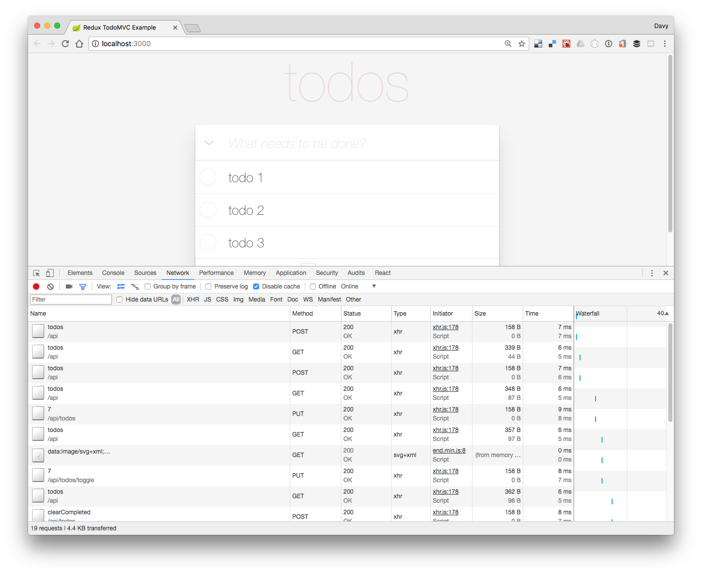

## Introduction

Goal of this project will be to setup a Spring Boot backend for the [ReactJS Redux TodoMvc example](https://github.com/reactjs/redux/tree/master/examples/todomvc/)

- ReactJS frontend is built using create-react-app
- Frontend build (using yarn) triggered via maven 
- Frontend code bundled with the Spring Boot backend in the same JAR
- SpringBoot CrudRepository backed REST controller (H2 in memory database)
- Docker image built via maven

## Running the app

There are several ways to start the app

- Using Maven : run `mvn spring-boot:run` in the root project folder and access http://localhost:8080 
- Using Yarn : go into the `./src/main/js` folder and run `yarn start` to start the React App in debug mode and access it via http://localhost:3000
- Using Docker : `docker run -ti -p 8080:8080 ddewaele/springboot-todo-mvc`

## Screenshot : 

## TODOs :

- Refactor some ReactJS code
- More error handling
- Update ReactJS tests
